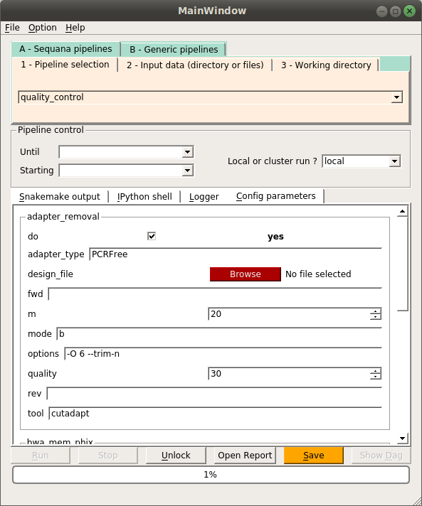
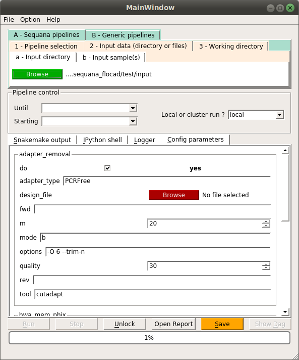
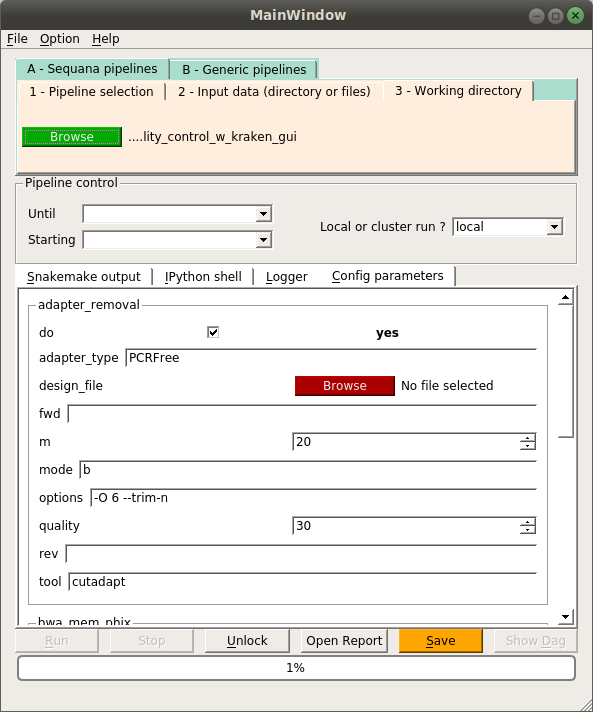
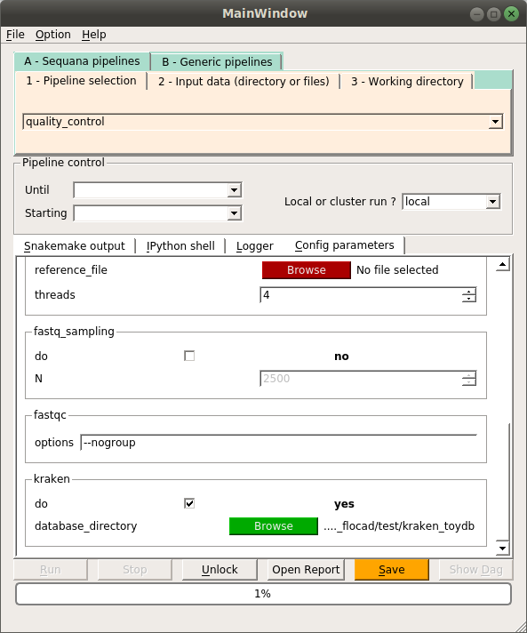
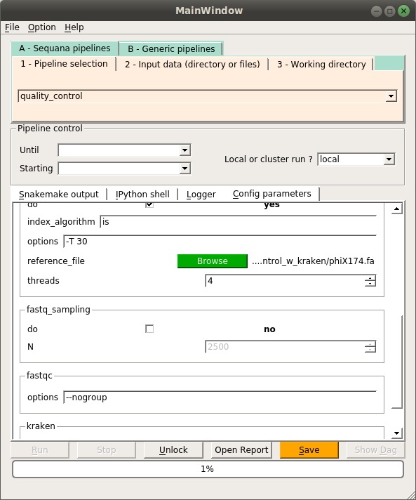

  
# Sequana  
  
* github: [https://github.com/sequana/sequana](https://github.com/sequana/sequana)  
* RTFD: [http://sequana.readthedocs.org/](http://sequana.readthedocs.org/)  
  
## On local 
  
### installation using conda    
  
```{bash, eval=FALSE}
#cd ~/src/
# git clone https://github.com/sequana/sequana.git

# add channels
conda config --add channels r
conda config --add channels bioconda

# sequana package requirements
head requirements.txt

# sequana optional packages
head optional.txt

# create a new environment
conda create -n sequana --file=requirements.txt --file=optional.txt

# activate
source activate sequana

# install sequana via pip
## pip install other dependencies
pip install sequana

```
  
### test quality control pipeline  
  
Overview:	Quality control, trimming (adapter removal) and taxonomic overview  
Input:	A set of FastQ (paired of single-end)  
Output:	fastqc, cleanup FastQ files    
   
#### default quality control pipeline      
  
```{bash, eval=FALSE}
ROOTDIR=$PWD

mkdir -p $ROOTDIR/test/quality_control
mkdir -p $ROOTDIR/test/input

# download input files
## 1500 reads
cd test/input
wget http://sequana.readthedocs.io/en/master/_downloads/Hm2_GTGAAA_L005_R1_001.fastq.gz
wget http://sequana.readthedocs.io/en/master/_downloads/Hm2_GTGAAA_L005_R2_001.fastq.gz

# initialise the pipeline quality control
cd $ROOTDIR/
## does not work: sequana --pipeline quality_control --output-directory test/quality_control --adapters PCRFree
sequana --pipeline quality_control --input-directory test/input --working-directory test/quality_control --adapters PCRFree
### for non-interactive mode: use --force 

"""
Welcome to Sequana standalone application
Looking for sample files matching /home/jtran1/Documents/IPS2/FLOCAD/bioinfo/sequana_flocad/test/input/*fastq.gz
Found 1 projects/samples 
Will override the following files if present: quality_control.rules config.yaml, runme.sh, ...
Do you want to proceed (to avoid this  message, use --force)? [y]/n:y
Copying snakefile
Creating README
Creating the config file
copied config.yaml from sequana quality_control pipeline
Initialisation of test/quality_control succeeded
Please, go to the project directory 

   cd test/quality_control

Check out the README and config.yaml files
A basic script to run the analysis is named runme.sh 

    sh runme.sh

On a slurm cluster, you may type:

  srun --qos normal runme.sh

In case of trouble, please post an issue on https://github.com/sequana/sequana/issue 
or type sequana --issue and fill a post with the error and the config file (NO DATA PLEASE)

"""

# review config.yaml
cd $ROOTDIR/test/quality_control
less config.yaml

# run the snakemamake helper bash script
sh runme.sh &>runme.sh.log


```

multi_summary.html report is OK. But kraken section report is missing.  
  
#### add kraken to default quality control pipeline      
  
```{bash, eval=FALSE}
# run the quality control using the kraken toy database

## download toy kraken database
### open python shell
python 

"""
Python 3.5.2 |Continuum Analytics, Inc.| (default, Jul  2 2016, 17:53:06) 
[GCC 4.4.7 20120313 (Red Hat 4.4.7-1)] on linux
Type "help", "copyright", "credits" or "license" for more information.
>>> from sequana import KrakenDownload, sequana_config_path
>>> kd = KrakenDownload()
>>> kd.download("toydb")
>>> print(sequana_config_path)
/home/jtran1/.config/sequana
>>> database_path = sequana_config_path + "/kraken_toydb"
>>> print(database_path)
/home/jtran1/.config/sequana/kraken_toydb
>>> 
"""

# initialise the quality control pipeline with kraken option
cd $ROOTDIR/
sequana --pipeline quality_control --input-directory test/input --working-directory test/quality_control_w_kraken --adapters PCRFree --kraken /home/jtran1/.config/sequana/kraken_toydb

"""
Welcome to Sequana standalone application
Looking for sample files matching /home/jtran1/Documents/IPS2/FLOCAD/bioinfo/sequana_flocad/test/input/*fastq.gz
Found 1 projects/samples 
Copying snakefile
Creating README
Creating the config file
copied config.yaml from sequana quality_control pipeline
Initialisation of test/quality_control_w_kraken succeeded
Please, go to the project directory 

   cd test/quality_control_w_kraken

Check out the README and config.yaml files
A basic script to run the analysis is named runme.sh 

    sh runme.sh

On a slurm cluster, you may type:

  srun --qos normal runme.sh

In case of trouble, please post an issue on https://github.com/sequana/sequana/issue 
or type sequana --issue and fill a post with the error and the config file (NO DATA PLEASE)

"""

# review config.yaml
cd $ROOTDIR/test/quality_control_w_kraken
less config.yaml

# run the snakemamake helper bash script
sh runme.sh &>runme.sh.log

```
  
multi_summary.html report is OK. Kraken/Krona reporting is OK.      
  
### test sequana gui  
  
```{bash, eval=FALSE}
sequana_gui 

"""
Creating directory /home/jtran1/.config/sequana 
Creating directory /home/jtran1/.config/biokit 
Creating directory /home/jtran1/.config/bioservices 
INFO:root:Welcome to Sequana GUI (aka Sequanix)
INFO:root:Initialising GUI
INFO:root:Reading settings
"""

# symlink kraken database
ln -s ~/.config/sequana/kraken_toydb kraken_toydb

```
    
#### Configure the pipeline:
  
  
  
    
  
  
  
   
  
  
  
[6. Save]()
```
=> save to config.yaml  
```

[7. Unlock]()  
  
[8. Run]()  
```
=> generate quality_control.rules  
=> download phiX174.fa reference genome into output directory  

``` 

  
  
[10. Save]()
```
=> overwrite config.yaml 
```

[11. Unlock]()  
   
[12. Run]()   
```
TOFIX: 

"""
AttributeError in line 29 of /home/jtran1/Documents/IPS2/FLOCAD/bioinfo/sequana_flocad/test/quality_control_w_kraken_gui/quality_control.rules:
\'collections.OrderedDict\' object has no attribute \'do\'
File "/home/jtran1/Documents/IPS2/FLOCAD/bioinfo/sequana_flocad/test/quality_control_w_kraken_gui/quality_control.rules", line 29, in 
"""

```   
  
**DEBUG**  
  
```{bash, eval=FALSE} 
# on the command line
cd /home/jtran1/Documents/IPS2/FLOCAD/bioinfo/sequana_flocad/test/quality_control_w_kraken_gui
snakemake -s quality_control.rules --stat stats.txt -p --cores 1 --configfile config.yaml

"""
AttributeError in line 29 of /home/jtran1/Documents/IPS2/FLOCAD/bioinfo/sequana_flocad/test/quality_control_w_kraken_gui/quality_control.rules:
'collections.OrderedDict' object has no attribute 'do'
  File "/home/jtran1/Documents/IPS2/FLOCAD/bioinfo/sequana_flocad/test/quality_control_w_kraken_gui/quality_control.rules", line 29, in <module>

"""

# is there a difference with previous rules? NO  
diff -q quality_control.rules ../quality_control_w_kraken/quality_control.rules

```
   
Bug confirmed.   
  
```{bash, eval=FALSE}
# Failed
snakemake -s quality_control.rules --stat stats.txt -p --cores 1 --configfile config.yaml

# Worked
snakemake -s quality_control.rules --stat stats.txt -p -j 4 --nolock

```
  
  
Test snakemake command lines using same gui input files:     
    
```{bash, eval=FALSE}
# ouput directory
mkdir $ROOTDIR/test/quality_control_w_kraken_3
cd $ROOTDIR/test/quality_control_w_kraken_3
rsync ../quality_control_w_kraken_2/quality_control.rules .
rsync ../quality_control_w_kraken_2/config.yaml .
rsync ../quality_control_w_kraken_2/phiX174.fa .

# Failed
snakemake -s quality_control.rules --stat stats.txt -p --cores 1 --configfile config.yaml
snakemake -s quality_control.rules --stat stats.txt -p --cores 4 --configfile config.yaml

# Worked
snakemake -s quality_control.rules --stat stats.txt -p -j 4 --nolock
snakemake -s quality_control.rules --stat stats.txt -p --cores 4

```  
  
So the --configfile option passed in argument caused the error.  
TODO: submit an issue  
  
    
## On garrod 
  
### installation using conda    
  
```{bash, eval=FALSE}
# using miniconda3
cd ../src/
git clone git@laforge.ips2.u-psud.fr:FLOCAD/sequana_eval.git

# add channels
git config --get channels
conda config --add channels r
conda config --add channels bioconda

# sequana package requirements
head requirements.txt

# sequana optional packages
head optional.txt

# create a new environment
conda create -n sequana --file=requirements.txt --file=optional.txt

# activate
source activate sequana

# install sequana via pip
## pip install other dependencies
pip install sequana

```    
    
### test quality control pipeline  
  
Overview:	Quality control, trimming (adapter removal) and taxonomic overview  
Input:	A set of FastQ (paired of single-end)  
Output:	fastqc, cleanup FastQ files    
   
#### add kraken to default quality control pipeline      
  
```{bash, eval=FALSE}
ROOTDIR=$PWD

mkdir -p $ROOTDIR/test/quality_control
mkdir -p $ROOTDIR/test/input

# download input files
## 1500 reads
cd test/input
wget http://sequana.readthedocs.io/en/master/_downloads/Hm2_GTGAAA_L005_R1_001.fastq.gz
wget http://sequana.readthedocs.io/en/master/_downloads/Hm2_GTGAAA_L005_R2_001.fastq.gz

# initialise the pipeline quality control
cd $ROOTDIR/

# run the quality control using the kraken toy database

## download toy kraken database
### open python shell
python 

"""
Python 3.5.2 |Continuum Analytics, Inc.| (default, Jul  2 2016, 17:53:06) 
[GCC 4.4.7 20120313 (Red Hat 4.4.7-1)] on linux
Type "help", "copyright", "credits" or "license" for more information.
>>> from sequana import KrakenDownload, sequana_config_path
Creating directory /home/IPS2/jtran1/cluster/.config/sequana 
Creating directory /home/IPS2/jtran1/cluster/.config/biokit 
Creating directory /home/IPS2/jtran1/cluster/.config/bioservices
>>> kd = KrakenDownload()
>>> kd.download("toydb")
>>> print(sequana_config_path)
/home/IPS2/jtran1/cluster/.config/sequana
>>> database_path = sequana_config_path + "/kraken_toydb"
>>> print(database_path)
/home/IPS2/jtran1/cluster/.config/sequana/kraken_toydb
>>> 
"""

# initialise the quality control pipeline with kraken option
cd $ROOTDIR/
sequana --pipeline quality_control --input-directory test/input --working-directory test/quality_control_w_kraken --adapters PCRFree --kraken /home/IPS2/jtran1/cluster/.config/sequana/kraken_toydb

"""
Welcome to Sequana standalone application
Looking for sample files matching /home/IPS2/jtran1/src/sequana_eval/test/input/*fastq.gz
Found 1 projects/samples 
Copying snakefile
Creating README
Creating the config file
copied config.yaml from sequana quality_control pipeline
Initialisation of test/quality_control_w_kraken succeeded
Please, go to the project directory 

   cd test/quality_control_w_kraken

Check out the README and config.yaml files
A basic script to run the analysis is named runme.sh 

    sh runme.sh

On a slurm cluster, you may type:

  srun --qos normal runme.sh

In case of trouble, please post an issue on https://github.com/sequana/sequana/issue 
or type sequana --issue and fill a post with the error and the config file (NO DATA PLEASE)

"""

# review config.yaml
cd $ROOTDIR/test/quality_control_w_kraken
less config.yaml

# run the snakemamake helper bash script
sh runme.sh &>runme.sh.log

# error glibc 2.14/2.15 not found maybe due to filesystem latency

# increase snakemake --latency-wait (default to 5 SECONDS => 10 SECONDS)
vim runme.sh

"""
snakemake -s quality_control.rules --stats stats.txt -p -j 4 --nolock --latency-wait 10

"""

# resume
sh runme.sh &>runme.sh.log

# error
TOFIX: dag and rulegraph rules are run using snakemake subrun, but the --latency-wait option is not passed from the main snakemake run.  

FIX: edit snakemake commands in dag.rules and rulegraph.rules
dag.rules: ~/miniconda3/envs/sequana/lib/python3.5/site-packages/sequana/rules/Misc/dag/dag.rules
 
"""
    run:
        # Create the dot file (graphviz) using snakemake
        shell("snakemake -s {input.filename} --dag --nolock --latency-wait 10 > {output.dot}")
        
"""

rulegraph.rules: ~/miniconda3/envs/sequana/lib/python3.5/site-packages/sequana/rules/Misc/rulegraph/rulegraph.rules

"""
    run:
        # Create the dot file (graphviz) using snakemake
        shell("snakemake -s {input.filename} --rulegraph --latency-wait 10 > {output.dot}")

"""

# resume
sh runme.sh &>runme.sh.log


# still the same error glibc files not found, maybe not a latency issue but missing glibc
TOFIX: install glibc 2.14 but conda does not provide this version
# conda install -c asmeurer glibc=2.19 => seg fault core dumped error cannot run snakemake
# conda install -c dan_blanchard glibc=2.18 => seg fault
# conda install -c acellera-basic compat-libc=2.14.0 => glibc dependency not resolved, still the same error
# conda install -c nlesc glibc=2.12.2 => glibc dependency not resolved, still the same error

# cannot resume
# sh runme.sh &>runme.sh.log

```
  
<!-- multi_summary.html report is OK. Kraken/Krona reporting is OK.       -->
         
    
    
    
# RStudio Notebook shortcuts  
  
Try executing this chunk by clicking the *Run* button within the chunk or by placing your cursor inside it and pressing *Ctrl+Shift+Enter*. 
  
Add a new chunk by clicking the *Insert Chunk* button on the toolbar or by pressing *Ctrl+Alt+I*.  
  
When you save the notebook, an HTML file containing the code and output will be saved alongside it (click the *Preview* button or press *Ctrl+Shift+K* to preview the HTML file).  
  